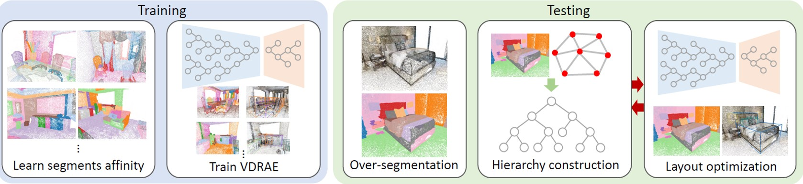

This is the code repository for ["Hierarchy Denoising Recursive Autoencoders for 3D Scene Layout Prediction"][1] .

IEEE Conference on Computer Vision and Pattern Recognition (CVPR) 2019

Created by Yifei Shi, Angel Xuan Chang, Zhelun Wu, Manolis Savva and Kai Xu

## Usage - VDRAE
### Dependancy
The code includes two components: data preprocessing and VDRAE.

### Data preparation
You need to process the [raw data](?) before feed it to VDRAE, please see [preprocess](?) for details. 

### VDRAE
The VDRAE is the main network of this project. After data preparation, you can train and test the scene by looking at [vdrae](https://github.com/yifeishi/HierarchyLayout/tree/master/vdrae).

## Citation
If you find the code is useful, please cite:
~~~~
@inproceedings{shi2019hierarchy, 
author = {Yifei Shi and Angel Xuan Chang and and Zhelun Wu and Manolis Savva and Kai Xu}, 
booktitle = {Proc. Computer Vision and Pattern Recognition (CVPR), IEEE}, 
title = {Hierarchy Denoising Recursive Autoencoders for 3D Scene Layout Prediction}, 
year = {2019}
}
~~~~

[1]:  https://arxiv.org/pdf/1903.03757.pdf "Hierarchy Denoising Recursive Autoencoders for 3D Scene Layout Prediction"
